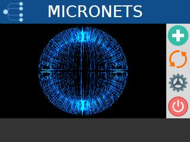
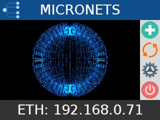
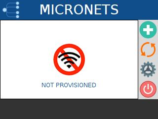
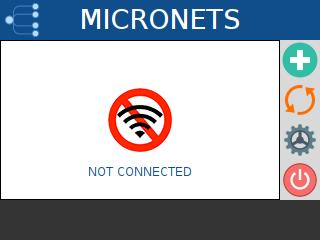
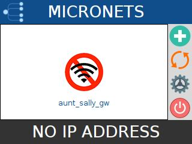
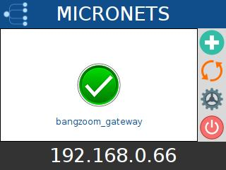
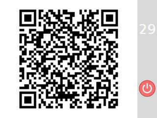
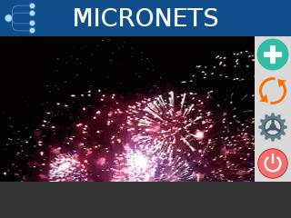

# Demo Mode Enhancements
This preliminary document describes the new screens and behavior for "Demo Mode" on the Raspberry Pi STA (IoT) device.

## Enabling Demo Mode
The following default settings in `/etc/micronets/config/config.json` are used to control demo mode.
```
  "demo": true,
  "splash_animation_seconds": 10,
  "onboard_animation_seconds": 5
```

## Startup Sequence

When rebooting the Pi or restarting the python application, an  application splash animation appears for a maximum of 10 seconds (configurable). The reasons for the splash screen are twofold:
  - If an ethernet cable is connected, the IP address of that network adaptor is displayed in the footer. This is to make it easy for developers to ssh into the device.
  - If the Pi has been provisioned onto a wifi network, this gives the Pi time to connect.

If the Pi connects to a pre-provisioned SSID during startup, the splash animation will terminate immediately after the connection is established - unless there is an ethernet cable connected, in which case the splash will remain until a total of 5 seconds has elapsed, such that the ethernet IP address can be observed.

**Note:** You can cancel the splash animation at any time by tapping on the animation or using any of the 4 function buttons:
 - onboard
 - cycle wifi
 - settings
 - power/restart



**Figure 1:** Splash Animation without ethernet


**Figure 2:** Splash Animation with ethernet

## Status Screen
At the end of the splash animation and at the end of an onboard operation, the display will reflect one of four states:
- The wifi adaptor has not been provisioned
- The wifi adaptor has been provisioned but failed to associate with the SSID
- The wifi adaptor has associated with the SSID but was unable to acquire an IP address
- The wifi adaptor has associated with the SSID and has acquired an IP address


**Figure 3:** Status Screen - Not Provisioned



**Figure 4:** Status Screen - Not Connected



**Figure 5:** Status Screen - Connected, but no IP address


**Figure 6:** Status Screen - Connected with IP address

## Onboard Sequence
Clicking the PLUS icon begins the onboarding sequence. A QR Code is displayed on the screen. Once the QR Code is scanned using the mobile configurator UI (Or tapped as a bypass operation), the DPP negotiation begins.

**Note:** The onboard sequence can be canceled by tapping the countdown field

####If the DPP onboarding is successful:
 - the countdown is canceled immediately
 - the QR Code is erased
 - a fireworks animation appears for 5 seconds
 - the status screen appears with a success status: (Figure 6).

####If the DPP onboarding fails:
 - the countdown reaches zero
 - the QR Code is erased
 - the status screen appears with a failed status:
    + Not provisioned (Figure 3)
    + Not associated (Figure 4)
    + Connected, but no IP address (Figure 5)

  
  **Figure 7:** Onboard Screen - QR Code displayed

  
  **Figure 8:** Onboard Success - Fireworks animation displayed

  **Note:** You can cancel the onboard animation at any time by tapping on the animation or using any of the 4 function buttons:
   - onboard
   - cycle wifi
   - settings
   - power/restart
