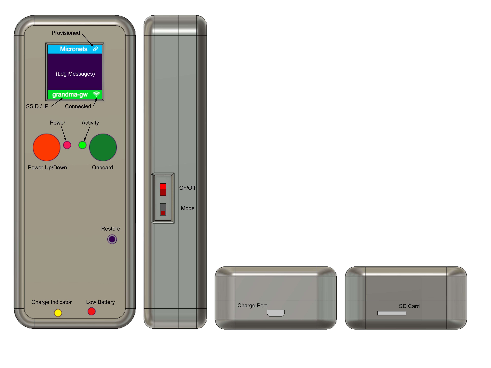
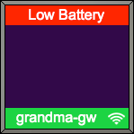

# ProtoMed User Manual

## Abstract
ProtoMed is a faux medical device that can be used to demonstrate the onboarding process for a medical device.
It consists of a Raspberry Pi Zero W, an OLED display, a Powerboost 500 charge unit, a 3.7v battery, and a variety of switches and discrete electronic components.

## Operation

### Battery
The battery should be fully charged before use. Plug the USB cable into the Charge Port. The Charge Indicator will be yellow while charging and green when fully charged. Note that the indicator will remain green only when the device is powered down - a yellow indicator means only that the battery is less than 100%.

When the battery is critically low, the red Low Battery LED will illuminate and the screen will display Low Battery. The device will power down in 60 seconds to prevent damage to the SD card.

## Usage
### Power Up
- Set On/Off switch to the ON (up) position
- Press Power Up/Down button
- Wait for device to boot and display to initialize (will take a minute or two)
### Onboard
- Open browser window to `https://alpineseniorcare.com/micronets2/portal/device-list`
- Press Onboard button
- Device appears in browser window
- Click on device to select it
- A window appears to select your Network Provider (MSO). Select one
- Browser window is redirected to the MSO for authorization to onboard device
- Either click the QRCode or scan the QRCode with iPhone running the iOS scanner app
- Progress window appears as device is onboarded
- ProtoMed device shows progress messages on the OLED display
- Onboard completes and the Provision icon is displayed in the header field
### Restore Defaults
- Use a paper clip to press the restore button on the front of the device
### Power Down
- Press the Power Up/Down button
- Shutdown message is displayed
- Device powers off
- Set On/Off switch to the OFF (down) position (optional)
### Restart Software w/out rebooting device (much quicker)
- Press and hold the Onboard Switch and then momentarily press the Power Up/Down Switch. You should see "Restarting.." displayed on the screen.

## Controls

#### On/Off Switch
When in the OFF (down) position, the battery is disconnected from the circuit. This is useful for preventing accidental power-up of the device and for forcing a power off of the device when necessary. (Use sparingly)

#### Mode Switch
This is a software defineable switch. Currently, when in the ON (up) position, a new key pair and device ID is generated before each onboarding operation. Default is OFF. This switch is also recessed and is accessed with a paper clip or other tool.

#### Restore Switch
This is a recessed momentary switch (use a paper clip to press). When pressed, the subscriber WiFi credentials are removed and the `wpa_supplicant.conf` file is reconstructed to contain only the default SSID (clinic) and an additional mobile Hot Spot SSID. More SSIDs can be added to this restored configuration by modifying `wpa_reset()` and adding additional configuration files to the `networks` folder. 

#### Power Up/Down Switch
This is a soft latching circuit for initiating the power-on (boot) sequence and the power-off (shutdown) sequence.

#### Onboard Switch
Press once to initiate the Onboard Sequence or to cancel an Onboard Sequence in progress.

#### Restart Application
To restart the `protomed.py` service, press and hold the Onboard Switch and then momentarily press the Power Up/Down Switch. You should see "Restarting.." displayed on the screen.

## Indicators
### OLED Display
#### Banner
A blue header that displays "Micronets". When the device has been provisioned with credentials for the subscriber's WiFi network, the Provisioned icon is also displayed.

#### Status
A green footer that displays the WiFi connection status. This consists of alternating fields of SSID and IP Address and a WiFi icon. If there is no connection, SSID will be blank, IP Address will display "NO IP ADDRESS" and the WiFi icon is not displayed. Note: If there is an issue with DHCP, you may see the SSID and WiFi icon displayed, but instead of the IP Address, you will see "NO IP ADDRESS".

#### Log Messages
Progress and Error Messages are displayed in the black area between the Banner and Status areas. After 30 seconds of inactivity, the message area is cleared.

### LED Indicators
#### Power Indicator
A red LED indicating that power has been applied to the Raspberry Pi.

#### Activity Indicator
A green LED indicator with the following states:

- OFF : The device has not been provisioned 
- ON : The device has been provisioned
- Blinking : Onboarding (provisioning) in progress

*NOTE: At this time, the device labeled "ProtoMed 1" has an inoperative Activity Indicator. This may be due to a bad GPIO port on the Raspberry Pi. However, the same information can be gleaned from the Provisioned Icon and the onscreen messages*

#Construction
##Case
The case is comprised of two 3D pieces (lid and base). There is also a small switch block to extend the On/Off switch to the surface of the case.

The case was designed using Autodesk Fusion 360 (Mac/PC). 

###Model
####Design Files
`model/ProtoMed Gen 2.f3d`

`model/Switch Block.f3d`

####STL Files
`model/ProtoMed Lid.stl`

`model/ProtoMed Base.stl`

`model/Switch Block.stl`

## Electronics
The device electronics are constructed using a prototype pcb with 2.54mm hole spacing, soldered on headers and wire wrapping as interconnects. It would be much easier to open an existing device and construct by example rather than describe each feature. The device could also be constructed simply by following the schematic diagram and using components and layout as desired. 

###Components

- Pi Zero W
- PowerBoost 500 (Adafruit)
- Lithium Ion 3.7v 350 mAh
- OLED SSD1351 Display
- Red 3mm LED
- Green 3mm LED
- (2) Momentary switches w/color caps (Power Up/Down & Onboard)
- (1) Momentary switch (Restore)
- (2) DPDT switch (On/Off & Mode)
- Resistor R1: 22K
- Resistor R2: 100K
- Resistor R3: 220K (100K-220K, varies EN hold time on power-up)
- Resistor R4: 4.7K (adjust for the specific LED)
- Resistor R5: 4.7K (adjust for the specific LED)
- Resistor R6: 10K
- Resistor R7: 10K
- Resistor R8: 10K
- Resistor R9: 10K
- Capacitor C1: 100uf
- Diode D1: 1N4001
- 2.54 single row headers (for wirewrapping)
- 2.54 double row right angle header (for P2 PCB interconnect)

